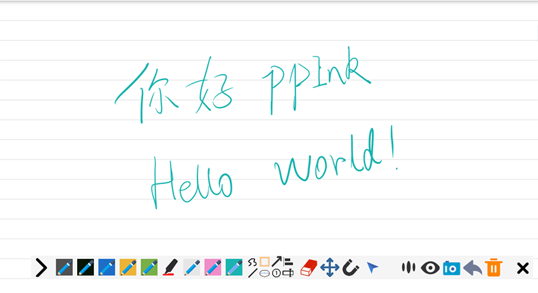

# ppInk
## 介绍

> ppInk是Windows下的屏幕注释软件，由gInk派生而来。与gInk相比，ppInk受到了另一个屏幕注释软件——Epic Pen极大启发，引入了一些新特性，但ppInk使用起来更加方便。ppInk/gInk的设计理念：界面简洁，使用演示文稿时不分散演讲者和观众的注意力。与许多同一类别的其他软件不同，您可以直接从钢笔切换到画笔，而不需要每次去改变颜色、透明度和尖端宽度。每支钢笔都是这些属性的组合，您可根据您的需要进行配置。

本项目仅针对ppInk中的UI和图标进行改进，同时改进了中文翻译。

## 绘图工具
> 手写、直线、矩形、椭圆、箭头、编号、文本左/右对齐

为了减少按钮的数量，有些按钮有多种功能，多次点击可以切换功能：

- 手形/矩形/省略号： 图形边框->填充笔颜色(C)->填充白色(W)->填充黑色(B)

- 编号：透明背景->编辑标签号码->白色背景->黑色背景

- 箭头：在开始处绘制箭头->在结束处箭头绘制
> 可以在 选项 中修改默认启用的选项

- 文本：文本左对齐->文本右对齐

- 移动：移动1个图形->移动所有图形。
- 编辑：
  - 短按：修改文本/数字工具（文本和字体）
  - 长按：编辑默认字体（针对会话时间）

## 磁性吸附
 磁铁按钮会激活一些图案的磁性吸附现象:

- 光标在图形周围能找到一个磁力点。对于矩形，顶点和每条边的中点都有磁性（也可以按Ctrl键激活）
- 文本框的8个顶点。（也可以按Ctrl键激活）
- 从原点开始，水平、垂直、每隔15°的直线都具有磁性（也可以按Shift键激活）磁距可以在选项中调整。

> 如果按下Ctrl键或Shift键，全局的磁性吸附现象会被临时关闭直到松开按键。这两个快捷键可用于所有工具、笔（可通过右键单击屏幕右下角的时钟旁边的程序图标进行配置）

## Alt 临时命令的快捷方式
在选项中激活此功能时（默认开启 ），按住Alt时，工具/笔/功能将变成临时选择，释放Alt键时，恢复上一按钮的功能。例如：选择画笔时，按Alt键不放，再按下R，此时矩形处于活动状态;松开Alt时，当前的功能将恢复成画笔。这可以使得笔与任何一个工具组合：例如：按住Alt可以临时启用填充的蓝色矩形，按下R两次或三次，用完后释放Alt键就会马上返回到以前的工具/颜色。Alt这一功能可以让画笔和橡皮一起使用。

## 立即启用捕获截图

当工具栏打开时，可以立即捕获当前屏幕，用选框截图。此选项默认设置为false。

## 长按编辑笔工具
用鼠标左键或右键长按可打开该笔的修改笔功能的对话框

## 清除面板
- 单击：删除所有图形并应用最后选定的背景

- 长按：删除所有图形并在选项中选择背景表面颜色（白色/黑色/自定义颜色（可通过选项修改）），你可以在打开时选择默认模式。自定义颜色建议：可以使用屏幕边框旁边的橡皮工具删除创建的背景底色。

## 光标样式

在程序所在的文件夹中，你可以将图片文件重命名为cursor.ico来配置自己的光标样式（
“位置”和“大小”都将从config.ini中加载）。同样，您可以将图片重命名为FloatingCall.png来修改浮动窗口的图标（宽度和透明度设置均在config.ini. ）

## 鼠标滚轮

你可以使用鼠标滚轮来修改笔触的大小，这让我们观察笔尖的大小变得更加容易。如果在选项中设置光标模类型为笔尖，可能很难找到鼠标，可以按下Alt键以获得箭头（或自定义的）光标

## 视频录制
ppInk现在有了录制视频的能力。在 **选项** - **视频** 选项卡中提供了可选择的功能：
- **使用FFmpeg进行基本录制**
> 首先需要安装FFmpeg。然后在“视频”选项卡中选择该选项。在这种情况下，录制按钮将弹出，点击之后您就可以开始或停止录制视频了。你可以通过 **选项**中的命令行来定义名称和目标文件夹。

- **使用OBS studio进行高级录制**
> 首先需要安装和配置OBS studio(https://obsproject.com/fr/download)和OBS websocket(https://github.com/Palakis/obs-websocket). 选择所需选项（录制或广播）。打开这一功能，您可以开始/停止广播或开始/暂停/恢复/停止视频录制。文件名和目标的文件夹请在在OBS studio中设置。

## 截图（UI改进后）

## 下载

<https://github.com/52fisher/ppInk/releases/>

## Change log

<https://github.com/52fisher/ppInk/blob/master/changelog.txt>

## 使用方法

- 运行ppInk.exe文件，系统右下角的托盘中会出现一个“g”的图标，可能会出现一个浮动工具栏注1

- （右键单击移动工具栏）选择适当的工具和画笔开始在屏幕上绘制。

- 开始绘制：

  - 单击浮动图标

  - 单击系统托盘中的图标

  - 使用全局快捷方式（默认为ctr+alt+G）

  - 如果“--startInking”（不区分大小写）已添加到命令行，则在运行ppInk后立即执行

- 再次运行ppInk（无需其他程序）

*注1*：显示浮动工具栏与保存位置在 **选项** 中可设置。

- 单击“退出”按钮或按ESC键可退出关闭工具栏。 

## Features

- 简洁直观的界面，可自定义快捷键键。
- 在动态桌面上呈现的墨迹。
- 绘图工具：手写、直线、矩形、椭圆、箭头、编号、标签、文本左/右对齐
- 画笔与橡皮擦、触摸屏和鼠标兼容。
- 点击穿透模式。（**注意**：切换为其他工具时才可用全局快捷方式，一旦切换则退出点击穿透模式）
- 支持多显示器
- 支持笔压感
- 支持截图功能
- 支持自定义快捷键
- 绘制图形可用磁性吸附
- 填充形状
- 录像

## 提示
- 已知对于不匹配的DPI设置（100%、125%、150%等）的多个显示器存在问题。如果您在具有不匹配DPI设置的多个显示器的计算机上使用gInk，或者遇到诸如截图保存位置不正确、无法将工具栏拖动到对应位置等问题，请执行以下操作作为解决方法（以Windows 10版本1903为例）：右键单击ppInk.exe- 文件 - 属性 - 兼容性 - 更改高DPI设置 - 启用替代高DPI缩放行为 - 缩放执行：应用程序。

- 未展示在**选项**窗口中的部分隐藏选项，你可以编辑config.ini文件进行调整。

## How to contribute translation

gInk/ppInk supports multiple languages now (ppInk introduces a few new sentences
where internationalization has not be implemented.). Here is how you can
contribute translation. Simply create a duplication of the file "en-us.txt" in
"bin/lang" folder, rename it and then translate the strings in the file. Check
in ppInk to make sure your translation shows correctly, and then you can make a
pull request to merge your translation to the next version of release for others
to use.

gInk  
https://github.com/geovens/gInk  
https://github.com/geovens/gInk  
Weizhi Nai \@ 2019

ppInk
https://github.com/pubpub-zz/ppInk
Pubpub-ZZ \@ 2020
